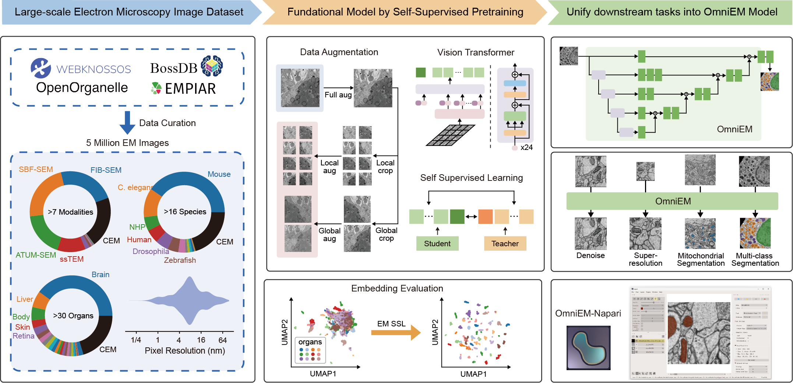

# Electron Microscopy Image Self-Supervised Learning (EM-SSL)

Welcome to **EM-SSL**, an end-to-end foundation-model-based toolkit for large-scale and standardized analysis of electron microscopy (EM) images.

This project introduces a unified framework for transferable representation learning and dense prediction across heterogeneous EM datasets, including **EM-5M**, **EM-DINO**, **OmniEM**, and an **Napari plugin** for interactive analysis and deployment.

---

## Overview



Electron microscopy enables nanoscale investigation of biological structures, yet practical analysis is often hindered by data heterogeneity, fragmented workflows, and task-specific models that fail to generalize across imaging conditions.

**EM-SSL** addresses these challenges by:
- Curating and standardizing a large-scale EM corpus (**EM-5M**, with more datasets planned)
- Pretraining an **EM-specific image foundation model** (**EM-DINO**) via self-supervised learning
- Developing **OmniEM**, a U-shaped architecture for restoration and segmentation across 2D and 3D EM tasks
- Providing an **end-to-end analysis workflow** through an integrated **Napari plugin**

---

## Project Components

### EM-5M: Large-Scale EM Corpus

**EM-5M** is a curated and standardized dataset comprising **5 million EM images**. It is designed to support **foundation model pretraining** and systematic evaluation of representation generalization in EM.

**Status**
- [ ] Dataset download
- [ ] Data curation & standardization scripts
- [ ] Contribution guidelines

---

### EM-DINO: EM Image Foundation Model

**EM-DINO** is an **EM-specific image foundation model** pretrained on EM-5M using self-supervised learning.

It provides transferable, multi-scale representations suitable for a wide range of downstream EM tasks.

**Status**
- [ ] Pretrained weights
- [ ] Usage guide (feature extraction and visualization)

---

### OmniEM: Dense Prediction Network

**OmniEM** is a **U-shaped architecture** built on top of EM-DINO representations, enabling unified **dense prediction** across EM tasks. It supports both 2D and 3D EM data and can be adapted to multiple restoration and segmentation scenarios.

**Status**
- [ ] Model weights
- [ ] Training and inference scripts
- [ ] Standalone Python module

---

### Napari-OmniEM: Interactive Analysis & Deployment

**Napari-OmniEM** integrates EM-DINO and OmniEM into a user-friendly graphical interface for interactive EM analysis.

**Features**
- OmniEM-based image restoration and segmentation
- Large-volume 2D / 3D EM inference and visualization
- Multi-GPU parallel inference
- Custom tasks with task-specific OmniEM models

**Status**
- [ ] Online documentation
- [ ] GitHub repository
- [ ] Napari plugin page
- [ ] Web-based inference server

---

## Applications

EM-SSL supports a wide range of EM analysis scenarios, including:

- Robust EM image representation learning
- Unsupervised and weakly supervised EM segmentation
- Modular workflows for EM image and volume processing
- **Community-driven extensions and new application ideas**

---

## Release History

- [x] **2026-01-28** — Main repository opened

---

## Citation

**Under review**

```
Unifying the Electron Microscopy Multiverse through a Large-scale Foundation Model. 
Liuyuan He, Ruohua Shi, Wenyao Wang, Guanchen Fang, Yu Cai, Lei Ma*.
```

---

## Acknowledgements

This work builds heavily upon several outstanding open-source projects and community resources.

Our model design and pretraining framework are largely inspired by [**DINOv2**](https://github.com/facebookresearch/dinov2/), and OmniEM-related training, evaluation, and deployment pipelines extensively rely on [**MONAI**](https://github.com/project-monai/monai). We sincerely thank the developers and maintainers of these projects for their foundational contributions to the field.

The EM-5M dataset was curated using data collected from multiple public repositories, including [**WebKnossos**](https://docs.webknossos.org/webknossos-py/index.html), [**OpenOrganelle**](https://www.openorganelle.org/), [**BossDB**](https://bossdb.org/), and [**EMPIAR**](https://www.ebi.ac.uk/empiar/). Data were accessed via their respective public APIs or officially supported access mechanisms, in accordance with each platform’s data access policies and terms of use. We are grateful to the teams behind these platforms for making high-quality electron microscopy data openly accessible to the research community.
