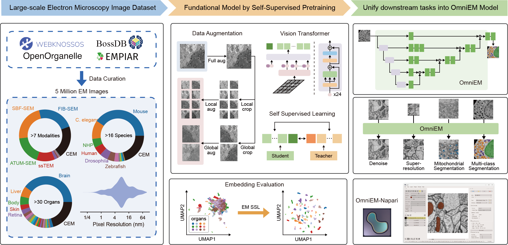

# Electron Microscopy Image Self-Supervised Learning (EM-SSL)

Welcome to **EM-SSL**, an end-to-end foundation-model-based toolkit for large-scale and standardized analysis of electron microscopy (EM) images.

This project introduces a unified framework for transferable representation learning and dense prediction across heterogeneous EM data. It brings together the **EM-5M** corpus, the **EM-DINO** foundation model, and the **OmniEM** dense-prediction network, exposed through multiple extensible Python APIs / packages and GUI software for interactive analysis and deployment.

---

## Overview



Electron microscopy enables nanoscale investigation of biological structures, yet practical analysis is often hindered by data heterogeneity, fragmented workflows, and task-specific models that fail to generalize across imaging conditions.

**EM-SSL** addresses these challenges through four components:
- **[Dataset](#dataset)**: a curated, standardized large-scale EM corpus (**EM-5M**, with more datasets planned)
- **[Models](#models)**: an EM-specific image foundation model (**[EM-DINO](https://github.com/pku-maleilab/omniem-package/tree/main#get-the-example-inputs-configs-and-weights)**, self-supervised) and **[OmniEM](https://github.com/pku-maleilab/omniem-package/tree/main#get-the-example-inputs-configs-and-weights)**, a U-shaped network for restoration and segmentation across 2D and 3D EM tasks
- **[Packages](#packages)**: a unified **[`omniem`](https://github.com/pku-maleilab/omniem-package)** core inference API (EM-DINO features + OmniEM dense prediction) plus an **[`omniem-train`](https://github.com/pku-maleilab/omniem-train)** training / fine-tuning tool
- **[GUI Software](#gui-software)**: an end-to-end interactive analysis workflow through the **[Napari-OmniEM](https://github.com/pku-maleilab/napari-omniem)** plugin

What ties these components together is one shared interface: the `omniem` package offers a single API for OmniEM prediction and EM-DINO feature extraction, reused by both `omniem-train` and Napari-OmniEM. We hope this common foundation makes pretrained inference, feature extraction, fine-tuning, deployment of user-trained models, and future preprocessing workflows a little easier to build on, and helps with the extensibility and reproducibility of the system.

---

## Table of Contents

- [Overview](#overview)
- [Project Components](#project-components)
  - [Dataset](#dataset)
  - [Models](#models)
  - [Packages](#packages)
  - [GUI Software](#gui-software)
- [Core API](#core-api)
- [Release History](#release-history)
- [Citation](#citation)
- [Acknowledgements](#acknowledgements)

---

## Project Components

### Dataset

**EM-5M (v1.0)** is a curated and standardized dataset comprising **5 million EM images**. It is designed to support **foundation model pretraining** and systematic evaluation of representation generalization in EM. Future releases will extend the corpus with additional datasets.

**Status**
- [ ] Dataset download
- [ ] Contribution guidelines

---

### Models

EM-SSL releases two complementary models (**EM-DINO** and **OmniEM**). Their weights and inference are delivered through the unified **`omniem`** package (see [Packages](#packages) and [Core API](#core-api) below), not as separate tools. For further information, check [`omniem`'s README](https://github.com/pku-maleilab/omniem-package/blob/main/README.md).

- **EM-DINO**: an **EM-specific image foundation model** pretrained on EM-5M via self-supervised learning. It provides transferable, multi-scale representations (global `cls`, local `patch`, and optional `inner`-block features) suitable for a wide range of downstream EM tasks.
- **OmniEM**: a **U-shaped dense-prediction network** built on top of EM-DINO representations. It unifies restoration and segmentation across 2D and 3D EM data behind a single `task_type` (`image2label` segmentation, `image2image` restoration).

**Status**
- [x] EM-DINO pretrained [weights](https://drive.google.com/drive/folders/1vpzVk6vDui8Aj34FdTMfJpXbt5wlMsx_?usp=drive_link)
- [x] OmniEM pretrained task models (segmentation / restoration): [model configs](https://drive.google.com/drive/folders/1cFPBmozY5VAh8ZgSe16U7ydX9RMmvbzu?usp=drive_link) and [head weights](https://drive.google.com/drive/folders/1vpzVk6vDui8Aj34FdTMfJpXbt5wlMsx_?usp=drive_link)

---

### Packages

EM-SSL ships its functionality as focused Python packages:

- **[`omniem`](https://github.com/pku-maleilab/omniem-package)**: the **core inference API**; bundles the EM-DINO encoder (feature extraction) and the OmniEM dense-prediction head behind one public CLI + Python API.
- **[`omniem-train`](https://github.com/pku-maleilab/omniem-train)**: **train or fine-tune OmniEM models** on your own data; built on `omniem`'s public API and writes weights that load straight back into `omniem`.
- **Data curation scripts**: curate and standardize raw EM data from public repositories into the EM-5M format (_coming soon_).
- and more ...

**Status**
- [x] `omniem` core inference [package repository](https://github.com/pku-maleilab/omniem-package)
- [x] `omniem-train` training / fine-tuning [tool repository](https://github.com/pku-maleilab/omniem-train)
- [ ] Data curation & standardization scripts

---

### GUI Software

**[Napari-OmniEM](https://github.com/pku-maleilab/napari-omniem)** integrates EM-DINO and OmniEM into a [Napari](https://napari.org) plugin for interactive EM analysis and deployment.

**Features**
- OmniEM-based image restoration and segmentation
- Large-volume 2D / 3D EM inference and visualization
- Multi-GPU parallel inference
- Deploy user-trained / fine-tuned OmniEM models

**Status**
- [ ] [Online documentation](https://pku-maleilab.github.io/EM-SSL-project/napari-omniem/) under active development.
- [x] GitHub repository
- [ ] Napari plugin page
- [ ] Web-based inference server

---

## Core API

The **[`omniem`](https://github.com/pku-maleilab/omniem-package)** package is the GUI-free Python core API of EM-SSL. It exposes the EM-DINO encoder and the OmniEM models behind one public API (CLI + Python), and underpins both `omniem-train` and Napari-OmniEM. Two capabilities cover the full surface:

- **Encoder features (EM-DINO).** `EMEncoder.load(...)` + `enc.run(...)` turns a 2D image or 3D volume into transferable representations (global `cls`, local `patch`, and optional `inner`-block features) for representation learning and custom downstream models.
- **Model inference (OmniEM).** `OmniEM.load(...)` + `model.run(...)` runs unified dense prediction: segmentation (`image2label`) and restoration / denoising / super-resolution (`image2image`), on both 2D and 3D EM data.

```python
from omniem import OmniEM

model = OmniEM.load("model.yaml", backbone="backbone_emdino_v1.pt", head="head.pt")
labels = model.run(image, axes="yx", dtype="uint8")   # raw grayscale image -> label map
```

These primitives support the core EM analysis scenarios:

- Robust EM image representation learning (EM-DINO features)
- Unsupervised and weakly supervised EM segmentation (OmniEM `image2label`)
- Image restoration: denoising and super-resolution (OmniEM `image2image`)
- Modular workflows for EM image and volume processing
- **Community-driven extensions and new application ideas**

See the [`omniem` documentation](https://github.com/pku-maleilab/omniem-package) for the full CLI and Python API.

---

## Release History

- [x] **2026-07-19**: Napari-OmniEM repository opened
- [x] **2026-06-24**: Released EM-DINO / OmniEM models, the `omniem` core API and packages, and refactored this README
- [x] **2026-01-28**: Main repository opened

---

## Citation

**Under review**

```
Unifying the Electron Microscopy Multiverse through a Large-scale Foundation Model. 
Liuyuan He, Ruohua Shi, Wenyao Wang, Guanchen Fang, Yu Cai, Lei Ma*.
```

---

## Acknowledgements

This work builds heavily upon several outstanding open-source projects and community resources.

Our model design and pretraining framework are largely inspired by [**DINOv2**](https://github.com/facebookresearch/dinov2/), and OmniEM-related training, evaluation, and deployment pipelines extensively rely on [**MONAI**](https://github.com/project-monai/monai). We sincerely thank the developers and maintainers of these projects for their foundational contributions to the field.

The EM-5M dataset was curated using data collected from multiple public repositories, including [**WebKnossos**](https://docs.webknossos.org/webknossos-py/index.html), [**OpenOrganelle**](https://www.openorganelle.org/), [**BossDB**](https://bossdb.org/), and [**EMPIAR**](https://www.ebi.ac.uk/empiar/). Data were accessed via their respective public APIs or officially supported access mechanisms, in accordance with each platform’s data access policies and terms of use. We are grateful to the teams behind these platforms for making high-quality electron microscopy data openly accessible to the research community.
