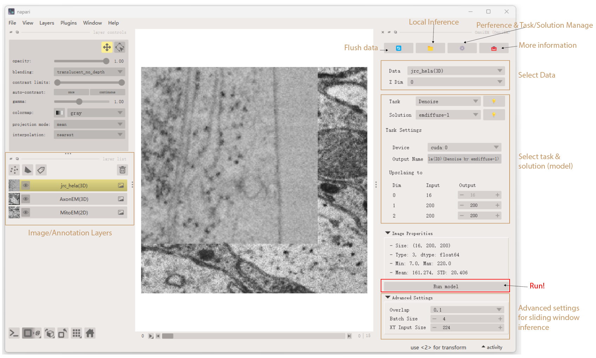

# Getting Started with Napari-OmniEM

This guide provides a quick introduction to **Napari-OmniEM** and helps you get up and running with your first inference task.

---

## Installation

Currently, Napari-OmniEM is supported **only via source installation**.  
Please follow the instructions in the [Installation Guide](user-guide/installation.md).

---

## Launch Napari and OmniEM

### Launch `napari` from the command line

```bash
napari
```

###  Enable the OmniEM plugin

In the napari menu bar, open **Plugins** and select **OmniEM**.


###  Load sample EM data
  
Napari-OmniEM provides built-in sample electron microscopy datasets for quick testing.

- Click to load sample files from the OmniEM panel


### Interface overview

After loading the OmniEM plugin and sample data, the napari interface should look similar to the following:



## Next Steps

Continue with the detailed user guides to explore OmniEM features:

- [In-memory Inference](user-guide/in-memory.md)

- [Local Inference](user-guide/local.md)

- [Sliding Window Parameters](user-guide/sw.md)

- [Task and Solution Manage](user-guide/manage.md)