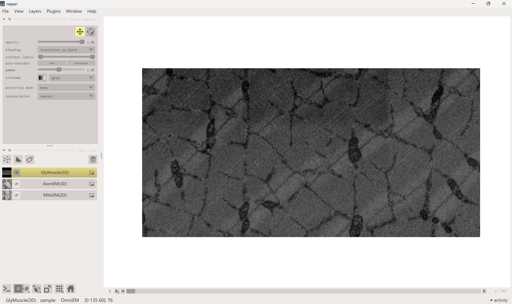
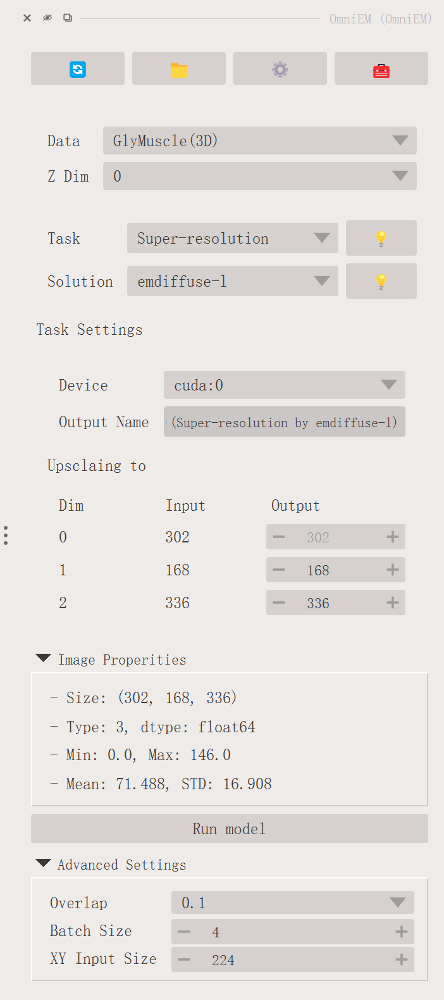
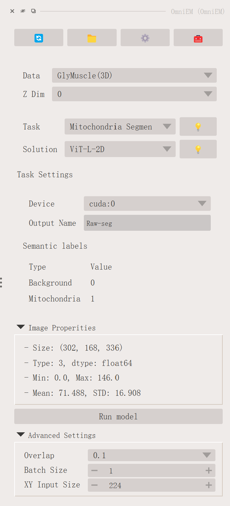
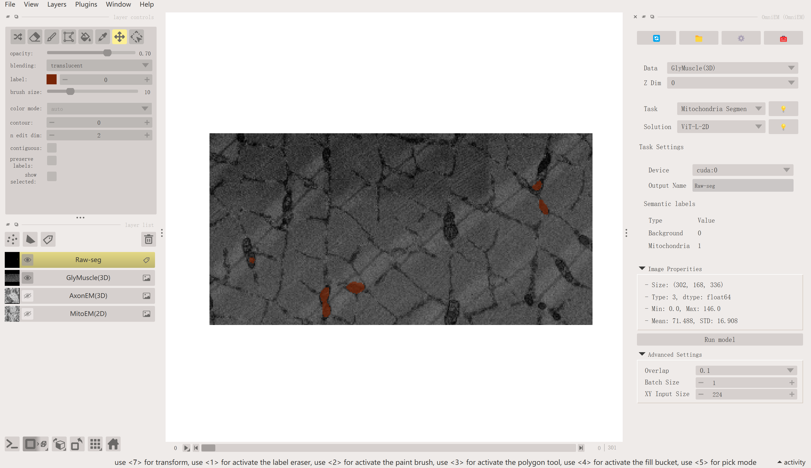
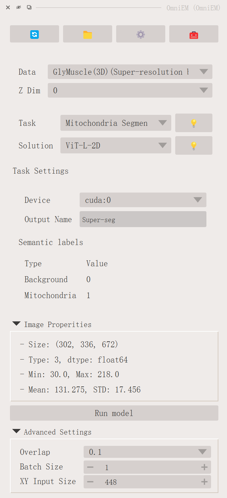
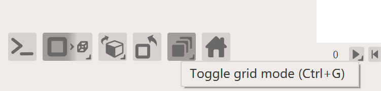
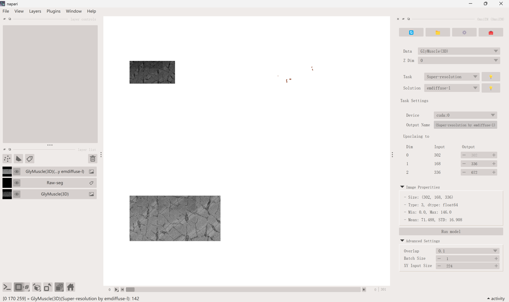
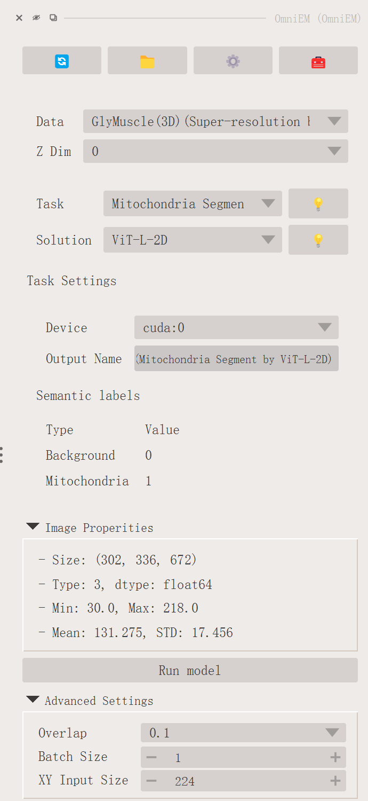
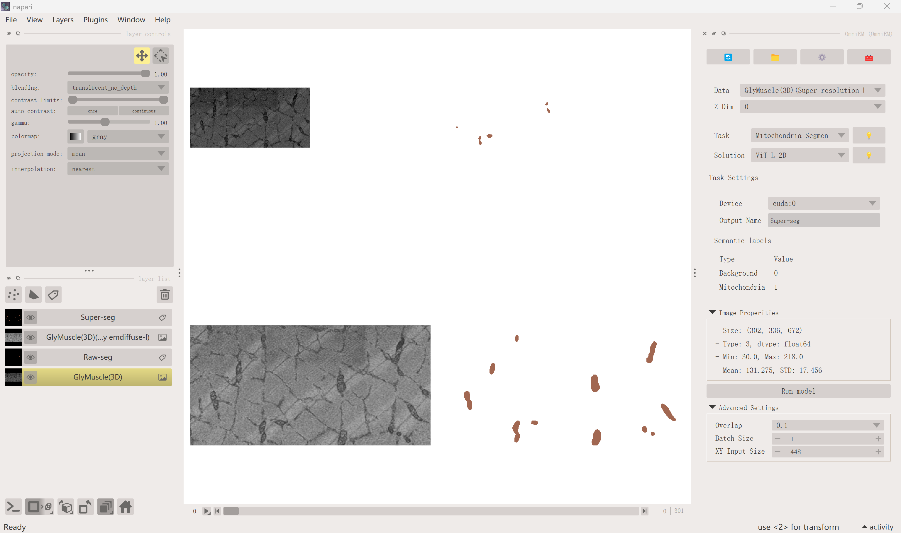
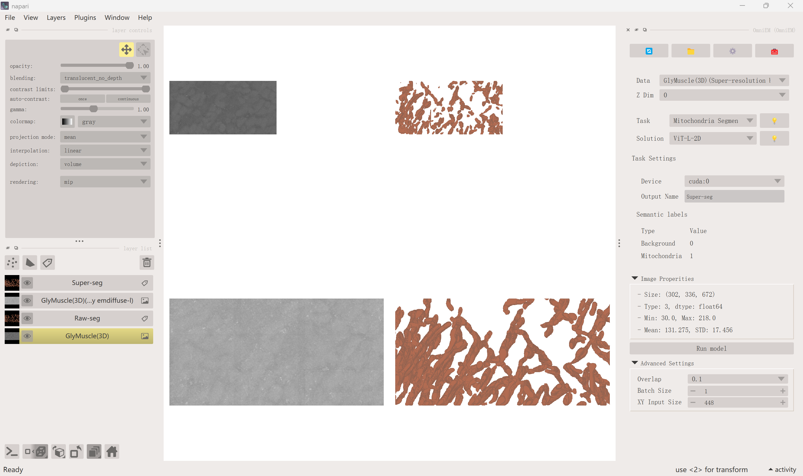

# Multi-Task Inference: Super-Resolution + Segmentation

One advantage of Napari-OmniEM is the ability to chain multiple models for analysis. This page demonstrates how applying super-resolution before segmentation can yield better mitochondria segmentation results compared to direct segmentation on the original data (Figure 5 in the manuscript).

The experiment uses the downsampled glycolytic muscle EM dataset from [MitoLab](). The downsampled data is available as sample data in Napari-OmniEM. This page walks through two workflows:

1. **Direct segmentation** — segment mitochondria directly in the downsampled data.
2. **Super-resolution + segmentation** — upsample the data first, then segment.

---

## Data

Click **File** → **Open Sample** → **EM (OmniEM)** to load the glycolytic muscle sample data.

Open the OmniEM panel and select the data in the **Data** dropdown. Set the z-dimension to `0`. Then open the **Image Properties** panel to verify the data size: `[302, 168, 336]`.

---

## Direct Mitochondria Segmentation

Select **Mitochondria Segmentation** in the **Task** dropdown. We recommend the `ViT-L-2D` solution for its better generalization. Adjust the hyperparameters as needed — for example, set the output name to `raw-seg` to identify the result, and reduce the batch size to `1` to reduce memory usage.

Click **Run model** and wait for the results.

---

## Super-Resolution

Select **Super-resolution** in the **Task** dropdown. Set the upscaling parameters under **Upscaling to**: set dim1 from `168` to `336`, and dim2 from `336` to `672`. (dim0 cannot be changed as it represents the z-axis.)

Click **Run model** to start super-resolution inference. After inference completes, we recommend removing unused data layers and switching to **Grid** view mode to compare results side by side.

---

## Mitochondria Segmentation on Super-Resolved Data

To use the super-resolved output, click the **🔄 Refresh / Register** button at the top of the OmniEM panel, then select the super-resolution image in the **Data** dropdown. Select **Mitochondria Segmentation** as the task. For better results, increase the **XY Input size** to a larger value (e.g., `448`) to better fit the increased data resolution.

Click **Run model** and wait for the segmentation results.

Switch to **3D view** mode to see the differences more clearly.

---

## Conclusion

Napari-OmniEM enables flexible chaining of multiple models within a single interactive workflow. By combining tasks such as super-resolution and segmentation, users can leverage complementary models to achieve better analysis outcomes than any single model alone. This composability is a core strength of the plugin, making it adaptable to diverse EM datasets and analysis goals.

---

## Related Links

- [In-memory Inference](../user-guide/in-memory.md)
- [Sliding Window Parameters](../user-guide/sw.md)
- [Model Zoo — Super-resolution](../model-zoo/superresolution.md)
- [Model Zoo — Mitochondria Segmentation](../model-zoo/mito.md)
