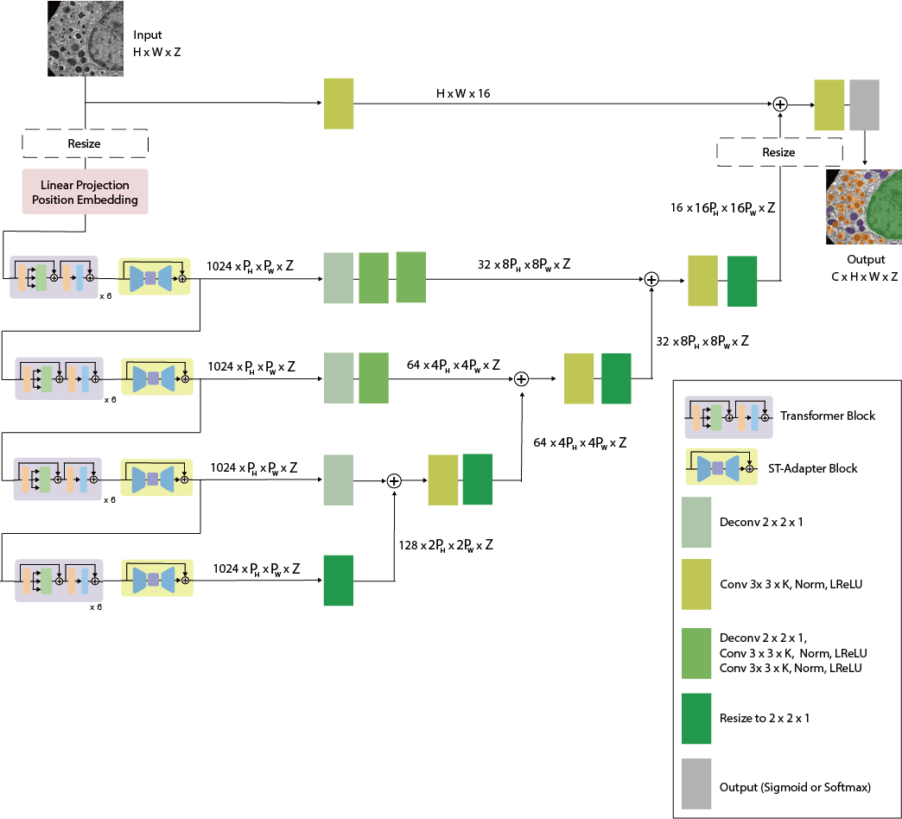

# Model Zoo

All models in **Napari-OmniEM** share the same core architecture: **OmniEM**.

## OmniEM Architecture

OmniEM is a unified framework designed to support multiple electron microscopy (EM) tasks within a consistent architectural paradigm.

Model behavior is determined by:

- **Task type**
- **Input dimensionality configuration**

---

## Task Types

Models are categorized by `tasktype`:

- Image Restoration  
  (e.g., super-resolution, denoising)

- Image Segmentation

---

## Dimensionality Support

OmniEM models can operate in either **2D** or **3D** mode.

### 2D Models

- `img_z = 1`
- Accept:
  - 2D input
  - 3D input (automatically reshaped into slice-wise 2D inference)
- 3D reshaping can be disabled by the user if inter-slice consistency is a concern.

### 3D Models

- `img_z > 1`
- Accept:
  - 3D input only
- Require minimum Z-dimension ≥ `img_z`
- No 2D inference allowed

---

## Data Type Configuration

The `datatypes` field defines acceptable input dimensionality:

- 2D data
- 3D data
---

## Available Models

### Image Restoration
- [Super-resolution](superresolution.md)
- [Denoise](denoise.md)

### Image Segmentation
- [Mitochondria Segmentation](mito.md) (2D & 3D variants)

## Training and Fine-tuning OmniEM

If you would like to train or fine-tune **OmniEM** on your own dataset, please refer to the official training repository.

👉 *The training repository will be publicly released soon.*

> Note: Models trained externally must export compatible weight files and configuration metadata to be imported into Napari-OmniEM.
