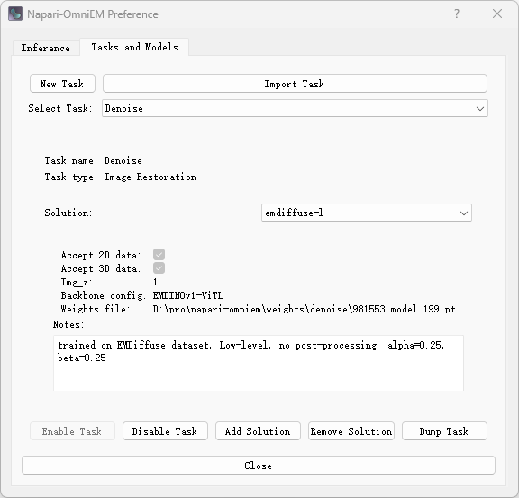
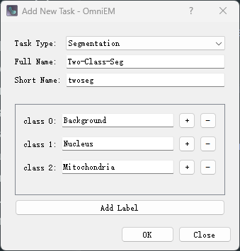
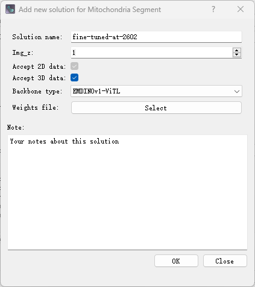

# Task and Solution Management

Napari-OmniEM allows users to manage tasks and solutions (models + configurations) directly from the main interface.

Task and solution management is accessed via:

- Click the ⚙️ **Settings** button in the main **Napari-OmniEM** panel
- Open the **Tasks and Models** tab

This page describes how to add, import, enable, disable, export, and remove tasks and solutions.

---

## Overview

In Napari-OmniEM:

- A **Task** defines the problem type (e.g., restoration, segmentation).
- A **Solution** defines a concrete implementation (model + configuration) for a task.

Tasks may contain multiple solutions.  
Solutions are always associated with exactly one task.



---

## Managing Tasks

### Add a New Task

To create a new task:

- Click **`New Task`** on the left side of the first row in the *Manage* panel.

#### Required Parameters

When creating a task, the following fields must be provided:

- **Task Type**  

    - `Image Restoration`  

    - `Segmentation`

- **Full Name**  
  The complete task name displayed in the Napari-OmniEM GUI selection menu.

- **Short Name**  
  A concise identifier used internally by Napari-OmniEM to store task-related information in local configuration files.

#### Additional Requirements for Segmentation Tasks

If the selected task type is **Segmentation**, additional information about output channels (labels) must be specified.

Please define each label individually and provide its semantic meaning.

For example:



Each label corresponds to one output channel of the model and defines its biological or structural meaning.

#### Validation Rules

- The **Full Name** must be unique within Napari-OmniEM.

- The **Short Name** must also be unique.

- Existing names cannot be reused. Please provide new identifiers if a conflict occurs.


---

### Import Task

To import an existing task:

- Click **`Import Task`** on the right side of the first row in the *Manage* panel.

- Select a `.yaml` file from your local system.

Napari-OmniEM will load the task definition from the selected YAML file and register it in the system.

#### Recommended Usage

For clarity and compatibility, we strongly recommend importing only YAML files that were generated using the **`Dump Task`** function within this panel.

Using externally modified or manually created YAML files may lead to:

- Schema incompatibility

- Missing required fields

- Version mismatch issues

To ensure reproducibility and structural consistency, use:

`Dump Task` → transfer/share YAML → `Import Task`


---

### Enable / Disable Task

To change the activation status of a task:

1. Select the target task from the task list (second row of the *Manage* panel).

2. After selection, the **`Enable Task`** and **`Disable Task`** buttons will appear in the last row of the panel.

#### Button Behavior

The availability of the buttons depends on the current status of the selected task:

- If the task is **active**:

    - `Disable Task` is enabled.

    - `Enable Task` is disabled.

- If the task is **disabled**:

    - `Enable Task` is enabled.

    - `Disable Task` is disabled.

This design prevents redundant operations.

#### Effect of Disabling a Task

- Disabled tasks will **not appear** in:

    - In-memory inference GUI selections

    - Local inference GUI selections

- Associated solutions remain stored but are not accessible until the task is re-enabled.

---

### Export (Dump) Task

To export a task configuration:

1. Select the target task from the task list (second row of the *Tasks and Models* panel).

2. Click the **`Dump Task`** button (appears after task selection).

3. Choose the destination directory and specify the filename for the exported `.yaml` file.

Napari-OmniEM will export the complete task definition, including all associated solutions, into a YAML configuration file.

#### Important Notes on Model Weights

- The **model weight file paths** stored in each solution are exported exactly as they are currently defined.

- The export process does **not** copy or relocate weight files.

- Only the file paths are written into the YAML file.

If the weight files are later moved to a different location, the corresponding path must be updated manually in the YAML file:

- Modify the `weights` field inside each solution entry.

Example structure:

```yaml
solution:
  - name: ExampleSolution
    weights: /path/to/model_weights.pth
    ... more configure items ...
```

---

## Managing Solutions

### Add a New Solution

To create a new solution:

- Click the **`New Solution`** button at the bottom of the *Manage* panel.

- A dialog window will open for configuration of the new solution.

#### Required Metadata



The following fields must be specified:

- **Solution Name**  
  The name displayed in the GUI selection menu.  
  It is also stored in the task YAML file.

- **img_z** and **Accept 2D / 3D Data (Checkboxes)**  
  The `img_z` parameter determines the acceptable input data pattern:

    - If `img_z == 1`:

        - The solution can accept both 2D and 3D data.

        - The 3D option may be manually disabled if slice-to-slice consistency is a concern.
  
    - If `img_z > 1`:

        - The solution accepts **3D data only**.

        - The 2D/3D selection checkboxes cannot be modified.

- **Backbone Type**  

    Currently, the only supported option is:
    - `EMDINOv1-ViTL`

- **Weights File**  
  Path to the trained model weights file.

- **Note**  
  Free-text field describing:
    - Model variation

    - Fine-tuning details

    - Training dataset

    - Any other relevant remarks

  This field is stored in the task YAML file.

#### Import and Validation

After clicking the **`OK`** button:

- Napari-OmniEM attempts to load the specified weights file using the provided metadata.

- The import process may take several seconds.

- If validation fails (e.g., incompatible weights or invalid configuration), the creation process is aborted and the solution is not added.

#### Important

- Metadata cannot be modified after the solution is successfully added.

- To change metadata, the solution must be removed and recreated.

---

### Remove Solution

To remove an existing solution:

1. Select the target solution from the solution list in the *Manage* panel.
2. Click the **`Remove Solution`** button located in the last row of the panel.
3. Confirm the removal action when prompted.

The selected solution will be removed from the task configuration.

#### Notes

- Removing a solution deletes it from the task YAML configuration.
- The associated model weight file is **not** deleted from disk.
- This action cannot be undone unless the solution configuration was previously exported.

---

## Best Practices

- Use descriptive task and solution names.
- Export tasks before major updates.
- Keep model weights organized in a dedicated directory.

---

## Notes
> `Remove Task` is currently under development and will be available in a future release of Napari-OmniEM.

> This page is under active development and will be updated with detailed configuration examples and schema documentation.
